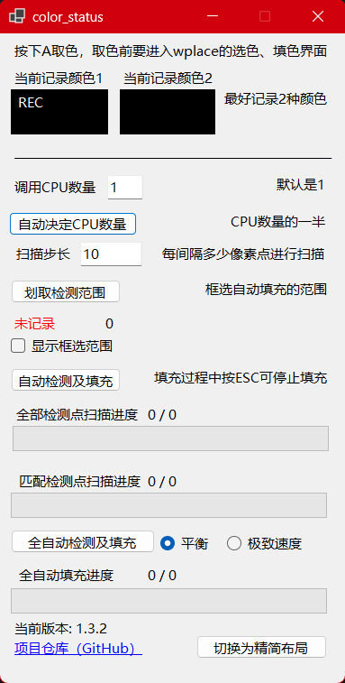
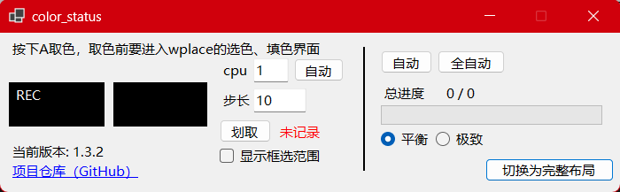

# 可用性测试：截止到 2026-07-07 18:48:45，该程序可用✅

# 这是什么？

这是一个辅助 wplace 涂色的 Windows 工具，用于配合 BlueMarble 渲染出来的像素方块进行取色、检测和自动填涂。






注意：该工具依赖 BlueMarble 渲染出来的像素方块。

# 如何使用？

工具提供以下主要功能：

1. 自动吸取颜色  
   鼠标放到 BlueMarble 渲染出来的方块上，按下 **A 键**，程序会自动触发 **键盘 i 键 + 鼠标左键**，也就是吸取颜色，并记录该颜色供后续使用。

2. 框选检测范围
   点击 **划取检测范围** 框选一个区域。程序会记录该区域，作为后续自动填涂/全自动填涂的范围。

3. 显示框选范围（可选）
   勾选"显示框选范围"后，程序会在屏幕上持续显示框选矩形，以及按当前扫描步长计算出来的待处理像素点网格。方便确认范围是否覆盖到了 BlueMarble 方块。

   - **步长实时预览**：选取范围并开启显示后，可以随时调整扫描步长，覆盖层上的像素点网格会**实时更新**。建议利用这一功能观察不同步长下待处理像素点的分布效果，确保点落在 BlueMarble 渲染的小方块上，避免步长过大漏掉目标、步长过小浪费算力。
   - 颜色检测 / A 键取色时会暂时隐藏覆盖层，检测完成后自动恢复显示。
   - 自动填涂 / 全自动填涂过程中，已经处理过的像素点会从覆盖层中消失，仅显示尚未处理的点。
   - 这只是可视化辅助，不开启也能正常使用自动和全自动功能。

4. 根据已选择颜色自动填涂  
   先通过 A 键吸取颜色，再框选检测范围，然后点击 **自动检测及填充**。程序会按设定的扫描步长在范围内扫描，当检测到像素点与记录颜色一致时，触发 **空格** 进行自动填涂。

   - 如果未取色，会提示“请通过 A 键选取颜色”。
   - 如果未框选范围，会提示“请框选范围”。

5. 全色彩全自动填涂  
   只需要先框选检测范围，然后点击 **全自动检测及填充**。程序会在框选范围内按设定步长检测所有预设颜色，并自动触发取色和空格填涂。

   - 如果未框选范围，会提示“请框选范围”。

# 界面布局

点击"切换为精简布局"可以切换到更小的横向界面，适合放在屏幕边缘；点击"切换为完整布局"可恢复默认纵向界面。

# 设置持久化

以下 UI 设置会在程序关闭时自动保存，下次启动时恢复：

- CPU 线程数
- 扫描步长
- 是否显示框选范围
- 速度模式（平衡 / 极致速度）
- 遗漏检测“不再提示”勾选状态

设置保存在 exe 同级目录下的 `user_settings.json`。文件缺失或损坏时会回退到默认值，不影响启动。删除该文件即可重置为默认设置。

# 如何更好地使用？

## 操作前建议切换到英文输入法

因为程序会自动发送键盘按键，非英文输入法可能导致按键输入异常。

## 按下 A 取色时，最好能取到 2 种颜色

wplace 的机制会在鼠标悬停到某个像素方块时放置灰色透明蒙板，导致屏幕上该点颜色发生变化。程序按 A 取色时会记录 2 种颜色：一种是鼠标悬停时的颜色，一种是鼠标移开后的颜色。这样可以减少因为悬停蒙板导致的误判。

## 选好扫描步长

扫描步长决定每次扫描会检测多少个点。步长太小会增加 CPU 计算时间，步长太大可能漏掉目标像素。建议在划取检测范围时观察扫描点是否落在 BlueMarble 渲染出来的小方块上。

## 区域自动填涂时设置好 CPU 核心数和扫描步长

CPU 线程数默认是 1，速度相对较慢。点击自动选择后，程序会检测 CPU 线程数并设置为一半，通常能明显提升扫描速度。

CPU 线程数只影响像素颜色判断速度，不影响实际填涂速度。

# 全自动填涂说明

全自动填涂会优先处理白色，再处理其他颜色。每种颜色的首个点会单独取色（吸取颜色）设为当前笔色，该色后续的点直接连续空格填涂，不再重复取色。

取色时若读到的真实底色不符合预期（落在已涂区域、扫描偏差、边缘串色等），程序会跳过该点，移至下一个候选点重新取色，直到取到合适的颜色再恢复填涂。以下两种情况会触发这一跳过逻辑。

## 白色跳过

白色阶段处理完成后，对后续颜色的首个候选点取色时，如果读到的真实底色仍然是白色，程序会认为该点不适合作为当前颜色的取色点（可能因扫描点偏差或已被白色阶段处理），跳过该点并继续尝试下一个候选点，直到取到非白色后再恢复正常取色和填涂。

这用于减少白色优先填涂后，后续颜色因首个候选点偏差而错误继续吸取白色的问题。属于高频常见情况，仅记调试日志。

## 已取色判重

全自动填涂会记录本次运行中已成功取色（并用作笔色）的颜色集合。当某个颜色的首个候选点取色时，如果读到的真实底色命中了**已取过的颜色**（通常是扫描点落在已涂区域、边缘抗锯齿串色等），程序会跳过本次填涂，鼠标移至该色的下一个候选点重新取色，循环直到取到一个未用过的颜色，再恢复正常填涂。

这避免用旧笔色（尤其是白色）覆盖掉当前正在填涂的颜色。白色样本已由上面的“白色跳过”单独处理，此处只命中非白色的旧笔色。

## 取色异常日志

“已取色判重”触发的跳过，以及某个颜色所有候选点都取到已用过的颜色而导致整组跳过，都会记录到 exe 同级目录的 `wplace_canYouHelpMe_error_log.txt`（自动按 1MB 轮转）。日志包含目标色、取到的颜色、发生坐标，便于定位是扫描步长偏差、范围框选问题还是串色。

# 遗漏检测

由于“极致速度”模式发送过快或扫描步长偏差，部分 BlueMarble 已渲染的方块可能未被成功填涂（遗漏点）。工具提供“孤岛检测”算法，自动找出这些遗漏点并补涂。

## 孤岛判据

遗漏点在空间上呈现“孤岛”特征：少量同色点被一圈未匹配颜色的“护城河”包围。算法据此判定：

1. **小簇**：同色点数 ≤ `IslandMaxSize`（默认 5）
2. **护城河**：紧邻外环中“非匹配点”占比 ≥ `IslandMoatRatio`（默认 0.5）
3. **外围同色大簇**（可选）：护城河外围存在同色大簇（区分“漏涂残留”与“图案本身独立的小色块”）。当护城河占比极高（≥ `IslandStrongMoatRatio`，默认 0.9）时自动跳过此条件——完美的护城河本身已是强信号。

采样采用品字形（六边形）网格，邻接按 6 邻居计算，避免连续已处理区被错误切断。

## 触发方式（手动）

- 完整布局：点击“运行遗漏检测”按钮。
- 精简布局：点击“全自动”右侧的“遗漏”按钮。

点击后对当前框选范围检测遗漏点。自动/全自动填涂完成后**不会**自动触发，需手动点击。

## 检测流程与确认弹窗

1. 扫描框选范围，对每个网格点判定匹配哪个预设色（不匹配的视作护城河来源）。
2. 同色聚类，找出符合判据的遗漏孤岛。
3. 遗漏点在覆盖层重新标注为待处理点（红色高亮），便于用户核对。
4. **居中遮罩弹窗**提示“检测到 N 处孤岛（M 个像素点），请确认这些点是否需要补涂”。弹窗以半透明遮罩覆盖程序界面，防止误点后面的控件。
5. 确认后自动补涂；取消则保留覆盖层标记，由用户手动处理。

弹窗带一个“不再提示”勾选框，勾选后本次及以后运行遗漏检测时不再弹出该建议提示（视作继续）。该选择会持久化保存，如需恢复提示，删除 exe 同级目录下的 `user_settings.json` 即可。

若未检测到遗漏点，弹窗会附带诊断信息（扫描点数、匹配数、同色簇与小簇分布、护城河占比），便于定位原因。

## 调参（命令行）

遗漏检测使用独立的颜色容差 `IslandColorTol`（默认 10），独立于全局 `ColorTol`，用于兜住已涂方块因悬停蒙板/抗锯齿产生的色差。其余参数均可通过命令行调整：

```
wplace_canYouHelpMe.exe --island-color-tol 15 --island-max-size 5 --island-moat-ratio 0.5 --island-strong-moat-ratio 0.9 --island-min-outer-multiplier 3.0 --island-search-radius 6
```

| 参数 | 默认 | 说明 |
|---|---|---|
| `--island-color-tol` | 10 | 专用颜色容差 |
| `--island-max-size` | 5 | 小簇绝对上限 |
| `--island-moat-ratio` | 0.5 | 护城河非匹配占比阈值 |
| `--island-strong-moat-ratio` | 0.9 | 强护城河阈值，达到则跳过条件3 |
| `--island-min-outer-multiplier` | 3.0 | 外围大簇相对比例 |
| `--island-search-radius` | 6 | 外围 BFS 搜索半径（网格层数） |
| `--island-require-outer-big` | true | 是否要求外围同色大簇 |

# 填涂速度模式

全自动检测及填充按钮旁边提供了两种速度模式，可根据需要切换：

1. **平衡**（默认）  
   大批量填涂时平均约 **150-160ms/点**，优先保证填涂准确性，适合大多数场景。  
   （构成：2 次空格发送 ×(40ms 延迟 + 30ms 前台焦点确认) + 10ms 间隔 ≈ 150ms；首点取色开销随点数增多摊薄到接近 0。）

2. **极致速度**  
   大批量填涂时平均约 **50-60ms/点**，速度最快但可能因发送过快导致个别像素点漏涂。适合需要快速完成大面积填涂的场景。如果发现漏涂较多，建议切换回平衡模式。  
   （构成：1 次空格发送 ×(20ms 延迟 + 30ms 前台焦点确认) ≈ 50ms；焦点确认为固定开销，是极致模式下的主要耗时来源。）

> 上述耗时为全自动批量填涂的后续点耗时，最贴近实际填涂体感。半自动填涂（连续按空格填涂）因每个点额外需要重新抢夺目标窗口焦点，平均每点再多约 60-80ms。两种模式下，每种颜色的首个点都需额外取色，约 500ms 以上，但只占整批 1/N，对大批量平均耗时影响可忽略。

# 构建与打包

当前版本：`1.4.6`

项目基于 .NET 8，所有命令在项目根目录下执行。

## 测试版本（Debug）

用于本地开发调试，包含调试符号，未优化。

```powershell
dotnet build -c Debug
```

输出路径：

```text
bin/Debug/net8.0-windows/wplace_canYouHelpMe.exe
```

## 测试版本（Release）

本地测试用，开启优化，不含调试符号，依赖系统安装的 .NET 运行时。

```powershell
dotnet build -c Release
```

输出路径：

```text
bin/Release/net8.0-windows/wplace_canYouHelpMe.exe
```

## 打包发布版本（自包含单文件）

自包含（self-contained），无需系统安装 .NET 运行时，单个可执行文件，可直接分发给用户。

### 打包命令

```powershell
dotnet publish .\WplaceColorWatch.csproj -c Release -r win-x64 --self-contained true -p:PublishSingleFile=true -p:EnableCompressionInSingleFile=true -p:DebugType=none -p:DebugSymbols=false -o .\publish\win-x64-single-exe
```

### 产物重命名（版本号后缀）

打包完成后，需要将输出的 exe 文件重命名，添加版本号后缀。版本号从 `.csproj` 的 `<AppVersion>` 读取。

**命名规范**：

```
{原始文件名}_v{版本号}.exe
```

示例：

```
wplace_canYouHelpMe.exe → wplace_canYouHelpMe_v1.1.0.exe
```

**版本号格式标准**：

- 格式：`_v{主版本}.{次版本}.{修订号}`
- 版本号来源：`WplaceColorWatch.csproj` 中的 `<AppVersion>` 节点
- 示例：`_v1.1.0`、`_v2.0.0`、`_v1.2.3`

**重命名命令**：

```powershell
# 读取版本号并重命名（在项目根目录下执行）
$version = (Select-Xml -Path .\WplaceColorWatch.csproj -XPath "//AppVersion").Node.InnerText
Rename-Item -Path .\publish\win-x64-single-exe\wplace_canYouHelpMe.exe -NewName "wplace_canYouHelpMe_v$version.exe"
```

**最终产物路径**：

```text
publish/win-x64-single-exe/wplace_canYouHelpMe_v{版本号}.exe
```

### 打包参数说明

| 参数 | 含义 |
|---|---|
| `-c Release` | 使用 Release 配置 |
| `-r win-x64` | 目标运行时为 Windows x64 |
| `--self-contained true` | 自包含模式，打包 .NET 运行时 |
| `-p:PublishSingleFile=true` | 输出为单个 exe 文件 |
| `-p:EnableCompressionInSingleFile=true` | 对单文件进行压缩 |
| `-p:DebugType=none` | 不生成 PDB 调试符号文件 |
| `-p:DebugSymbols=false` | 不嵌入调试符号 |
| `-o .\publish\win-x64-single-exe` | 输出到指定目录 |

# 许可证

本项目采用 Mozilla Public License 2.0 授权。具体条款请查看 LICENSE 文件。

This project is licensed under the Mozilla Public License 2.0. See the LICENSE file for details.
