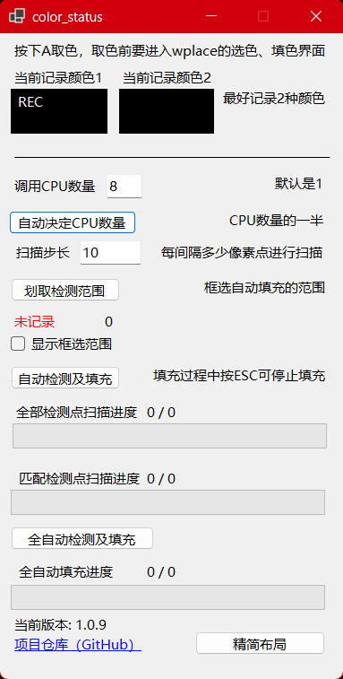
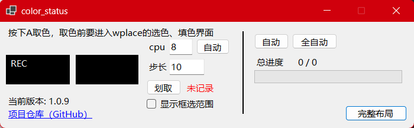

# 可用性测试：截止到 2026-06-19 18:17:42，该程序可用✅

# 这是什么？

这是一个辅助 wplace 涂色的 Windows 工具，用于配合 BlueMarble 渲染出来的像素方块进行取色、检测和自动填涂。





注意：该工具依赖 BlueMarble 渲染出来的像素方块。

# 如何使用？

工具提供以下主要功能：

1. 自动吸取颜色  
   鼠标放到 BlueMarble 渲染出来的方块上，按下 **A 键**，程序会自动触发 **键盘 i 键 + 鼠标左键**，也就是吸取颜色，并记录该颜色供后续使用。

2. 框选检测范围
   点击 **划取检测范围** 框选一个区域。程序会记录该区域，作为后续自动填涂/全自动填涂的范围。

3. 显示框选范围（可选）
   勾选"显示框选范围"后，程序会在屏幕上持续显示框选矩形，以及按当前扫描步长计算出来的待处理像素点网格。方便确认范围是否覆盖到了 BlueMarble 方块。

   - **步长实时预览**：选取范围并开启显示后，可以随时调整扫描步长，覆盖层上的像素点网格会**实时更新**。建议利用这一功能观察不同步长下待处理像素点的分布效果，确保点落在 BlueMarble 渲染的小方块上，避免步长过大漏掉目标、步长过小浪费算力。
   - 颜色检测 / A 键取色时会暂时隐藏覆盖层，检测完成后自动恢复显示。
   - 自动填涂 / 全自动填涂过程中，已经处理过的像素点会从覆盖层中消失，仅显示尚未处理的点。
   - 这只是可视化辅助，不开启也能正常使用自动和全自动功能。

4. 根据已选择颜色自动填涂  
   先通过 A 键吸取颜色，再框选检测范围，然后点击 **自动检测及填充**。程序会按设定的扫描步长在范围内扫描，当检测到像素点与记录颜色一致时，触发 **空格** 进行自动填涂。

   - 如果未取色，会提示“请通过 A 键选取颜色”。
   - 如果未框选范围，会提示“请框选范围”。

5. 全色彩全自动填涂  
   只需要先框选检测范围，然后点击 **全自动检测及填充**。程序会在框选范围内按设定步长检测所有预设颜色，并自动触发取色和空格填涂。

   - 如果未框选范围，会提示“请框选范围”。

# 界面布局

点击“精简布局”可以切换到更小的横向界面，适合放在屏幕边缘；点击“完整布局”可恢复默认纵向界面。

# 如何更好地使用？

## 操作前建议切换到英文输入法

因为程序会自动发送键盘按键，非英文输入法可能导致按键输入异常。

## 按下 A 取色时，最好能取到 2 种颜色

wplace 的机制会在鼠标悬停到某个像素方块时放置灰色透明蒙板，导致屏幕上该点颜色发生变化。程序按 A 取色时会记录 2 种颜色：一种是鼠标悬停时的颜色，一种是鼠标移开后的颜色。这样可以减少因为悬停蒙板导致的误判。

## 选好扫描步长

扫描步长决定每次扫描会检测多少个点。步长太小会增加 CPU 计算时间，步长太大可能漏掉目标像素。建议在划取检测范围时观察扫描点是否落在 BlueMarble 渲染出来的小方块上。

## 区域自动填涂时设置好 CPU 核心数和扫描步长

CPU 线程数默认是 1，速度相对较慢。点击自动选择后，程序会检测 CPU 线程数并设置为一半，通常能明显提升扫描速度。

CPU 线程数只影响像素颜色判断速度，不影响实际填涂速度。

# 全自动填涂说明

全自动填涂会优先处理白色，再处理其他颜色。

从白色处理完成后的下一次自动取色开始，如果当前候选点取到的真实颜色仍然是白色，程序会认为该候选点可能因为扫描点偏差或已被白色阶段处理而不适合作为当前颜色的取色点。此时程序会跳过该点，继续尝试下一个候选点，直到取到非白色后再恢复正常的取色和填涂流程。

这个逻辑用于减少白色优先填涂后，后续颜色因为首个候选点偏差而错误继续吸取白色的问题。

# 构建与打包

当前版本：`1.2.1`

项目基于 .NET 8，所有命令在项目根目录下执行。

## 测试版本（Debug）

用于本地开发调试，包含调试符号，未优化。

```powershell
dotnet build -c Debug
```

输出路径：

```text
bin/Debug/net8.0-windows/wplace_canYouHelpMe.exe
```

## 测试版本（Release）

本地测试用，开启优化，不含调试符号，依赖系统安装的 .NET 运行时。

```powershell
dotnet build -c Release
```

输出路径：

```text
bin/Release/net8.0-windows/wplace_canYouHelpMe.exe
```

## 打包发布版本（自包含单文件）

自包含（self-contained），无需系统安装 .NET 运行时，单个可执行文件，可直接分发给用户。

### 打包命令

```powershell
dotnet publish .\WplaceColorWatch.csproj -c Release -r win-x64 --self-contained true -p:PublishSingleFile=true -p:EnableCompressionInSingleFile=true -p:DebugType=none -p:DebugSymbols=false -o .\publish\win-x64-single-exe
```

### 产物重命名（版本号后缀）

打包完成后，需要将输出的 exe 文件重命名，添加版本号后缀。版本号从 `.csproj` 的 `<AppVersion>` 读取。

**命名规范**：

```
{原始文件名}_v{版本号}.exe
```

示例：

```
wplace_canYouHelpMe.exe → wplace_canYouHelpMe_v1.1.0.exe
```

**版本号格式标准**：

- 格式：`_v{主版本}.{次版本}.{修订号}`
- 版本号来源：`WplaceColorWatch.csproj` 中的 `<AppVersion>` 节点
- 示例：`_v1.1.0`、`_v2.0.0`、`_v1.2.3`

**重命名命令**：

```powershell
# 读取版本号并重命名（在项目根目录下执行）
$version = (Select-Xml -Path .\WplaceColorWatch.csproj -XPath "//AppVersion").Node.InnerText
Rename-Item -Path .\publish\win-x64-single-exe\wplace_canYouHelpMe.exe -NewName "wplace_canYouHelpMe_v$version.exe"
```

**最终产物路径**：

```text
publish/win-x64-single-exe/wplace_canYouHelpMe_v{版本号}.exe
```

### 打包参数说明

| 参数 | 含义 |
|---|---|
| `-c Release` | 使用 Release 配置 |
| `-r win-x64` | 目标运行时为 Windows x64 |
| `--self-contained true` | 自包含模式，打包 .NET 运行时 |
| `-p:PublishSingleFile=true` | 输出为单个 exe 文件 |
| `-p:EnableCompressionInSingleFile=true` | 对单文件进行压缩 |
| `-p:DebugType=none` | 不生成 PDB 调试符号文件 |
| `-p:DebugSymbols=false` | 不嵌入调试符号 |
| `-o .\publish\win-x64-single-exe` | 输出到指定目录 |

# 许可证

本项目采用 Mozilla Public License 2.0 授权。具体条款请查看 LICENSE 文件。

This project is licensed under the Mozilla Public License 2.0. See the LICENSE file for details.
