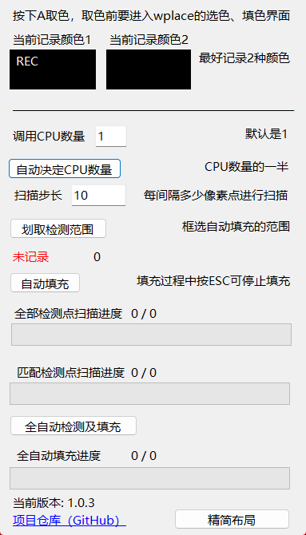
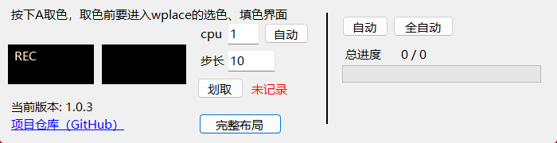

# 这是什么？

这是一个辅助wplace涂色的工具，辅助进行涂色。

注意：该工具依赖于BlueMarble渲染的像素方块。
# 如何使用？

工具提供了以下主要功能：

1、自动吸取颜色，鼠标放到BlueMarble渲染出来的方块上，按下**A键**，自动触发**“键盘i键+鼠标左键”**，也就是吸取颜色，并记录颜色以供后续使用。

2、根据选择的颜色自动填涂，在做了第1步之后，也就是通过A键吸取好颜色之后，点击**“划取检测范围”**按钮框选一个范围，程序会对范围内所有像素点以**某种间隔**的形式进行遍历扫描，当检测到某个像素点与记录颜色一致时，触发**“空格”**，也就是自动填涂。

3、全色彩全自动填涂，该操作只需要确定范围，当你框选好范围之后，点击**全自动检测及填充**，程序会在你框选的范围内，以设定的步长间隔，进行像素点的颜色检测及自动填充，会自动触发键盘i键+鼠标左键，吸取颜色，也会自动触发空格，进行填涂。

# 如何更好的使用？

## 操作前最好将输入法切换为英文

因为涉及按键，非英文输入法可能导致触发键盘输入。

## 按下A取色时，最好能取到2种颜色

这是由于wplace的机制，当鼠标放到wplace地图上的某个像素方块时，会在该方块上放置一个灰色透明蒙板，这会导致屏幕上该点的像素颜色发生变化，从而导致程序取到颜色后发现颜色不同而错判，于是我设定了使用A键取色时记录2种颜色，2种颜色都表示同一色块，只不过是被灰色透明蒙板挡住了以及没有挡住的颜色区别，这样程序就能更好的确定色块，减少错判的情况。

## 选好扫描步长间隔

扫描步长间隔将直接决定每次扫描要扫描多少个点，太密集会导致CPU算很久，太稀疏可能会导致识别不到，可以在划取检测范围时，看一看要扫描的像素点是否落在了blue marble渲染出来的小方块上。

## 区域自动填涂时，设定好CPU核心数以及像素点判定间隔

CPU线程数量默认为1，但是可能会有点慢，如果选择让程序自动选择，那么程序会检测你的CPU线程数量，并设置为一半，这样并行运算速度会很快。

CPU的数量只影响像素点的色彩判断速度，不影响像素方块的填充速度。

---

本项目采用 Mozilla 公共许可证 2.0 授权。具体条款请查看 LICENSE 文件。

This project is licensed under the Mozilla Public License 2.0. See the LICENSE file for details.
